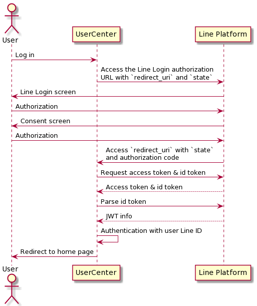

# User Center

## Line Login Flow in UserCenter
1. 點擊 `Sign in with Line`
2. 轉跳至Line 登入頁面
3. 登入後，Line 要求使用者授權哪些權限給 UserCenter
4. 完成授權後，Line 重新導向 `/line/login/callback`，並挾帶用來請求access token的 `code` 及防止XSS攻擊的 `state`
5. 透過取得的 `code`，打 Line API 取得 `id_token` ，並進而獲得使用者的 `Line ID`
6. 以 `Line ID` 及 `Illuminate\Support\Facades\Auth` 進行內部的使用者驗證
7. 完成驗證後，轉跳至首頁

## Trouble shooting
- [MacOS M1 建立 MySql 映像失敗](https://learnku.com/laravel/t/60298)
- [延長 PhpMyAdmin 的連線時間](https://github.com/laradock/laradock/issues/1718)
- [ngrok in docker](https://github.com/laradock/laradock/issues/2068#issuecomment-680416959)

## References
- [Line Documentation](https://developers.line.biz/en/docs/)
- [nginx redirect http to https](https://gist.github.com/dorelljames/9da3063878b9c3030d6538b6724122ac#file-laravel-nginx-config-make-http-exception-url-and-make-all-others-https-md)
- [Laravel with Line Login](https://yulinchou.medium.com/%E5%88%A9%E7%94%A8-laravel-%E5%AF%A6%E4%BD%9C-line-%E7%99%BB%E5%85%A5-%E4%B8%A6%E5%8F%96%E5%BE%97%E4%BD%BF%E7%94%A8%E8%80%85%E7%9A%84-id-%E5%8F%8A-%E8%B3%87%E6%96%99-f95784ca9595)
- [Laravel with Line Login (2)](https://medium.com/@r3850355/%E7%AD%86%E8%A8%98-laravel-%E5%89%8D%E5%BE%8C%E7%AB%AF%E5%88%86%E9%9B%A2%E4%B8%8B%E7%9A%84-line-login-%E9%A9%97%E8%AD%89%E6%A9%9F%E5%88%B6-8d4bede8d47e)
- [Hydra Setup](https://www.ory.sh/hydra/docs/5min-tutorial)

## Improvement
### 2022.01.05
- [x] 執行環境
- [x] 注入 `GuzzleHttp\Client`
    > 以建構子注入
- [x] XSS state 判斷是否為有效
    > `state` 存入 `Session`，callback 之後取出進行驗證
- [x] 解決波動拳 （兩層為限）
- [ ] Exception custom render
